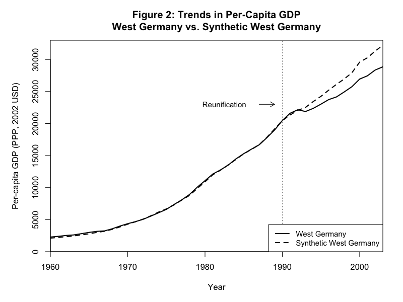
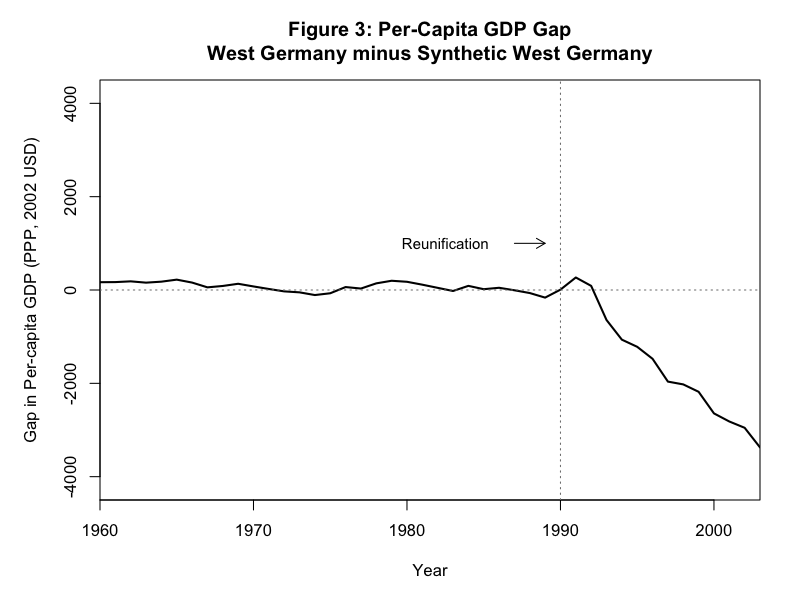
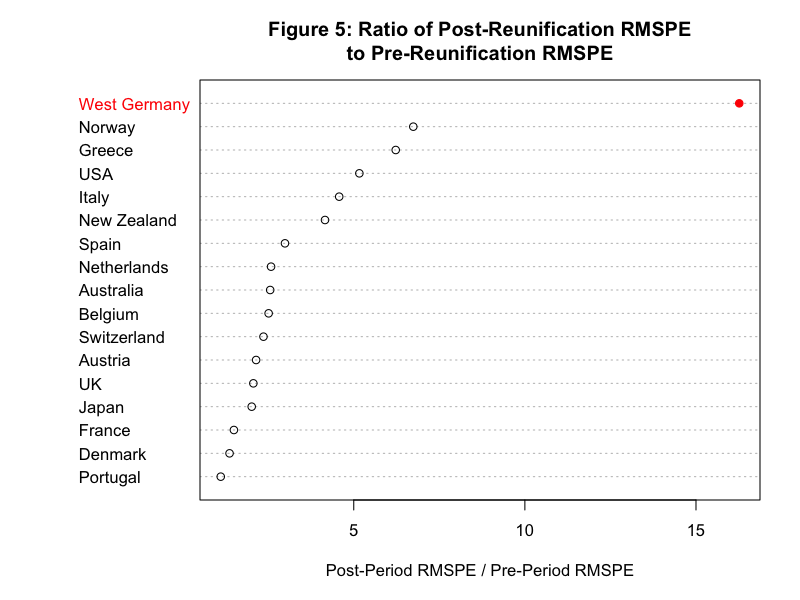
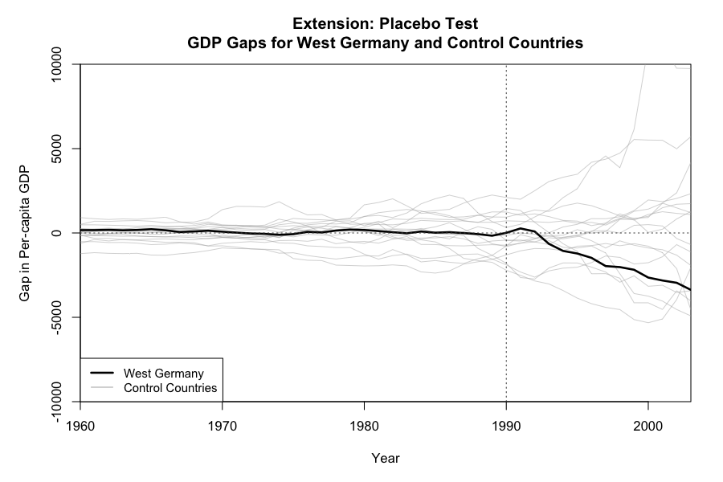
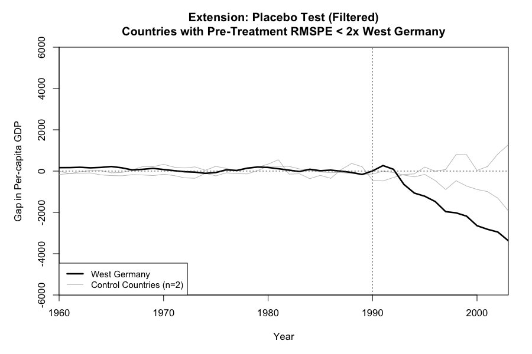

# Replication and Extension of "Comparative Politics and the Synthetic Control Method"

**A Response Article**

---

**Author:** Ahmed Bakr 
**Course:** CS130 - Causal Inference  
**Date:** December 2025

---

## Executive Summary

This paper presents a replication and extension of Abadie, Diamond, and Hainmueller's (2015) seminal work "Comparative Politics and the Synthetic Control Method" published in the *American Journal of Political Science*. We successfully replicate the main findings regarding the economic impact of German reunification on West Germany's per-capita GDP. Our extension introduces a comprehensive placebo test analysis to assess the statistical significance of the treatment effect. The replication confirms that German reunification had a substantial negative effect on West Germany's per-capita GDP, estimated at approximately $1,571 (6.0%) below the synthetic counterfactual by 2003.

---

## 1. Introduction

### 1.1 Original Paper Summary

**Citation:** Abadie, A., Diamond, A., & Hainmueller, J. (2015). Comparative Politics and the Synthetic Control Method. *American Journal of Political Science*, 59(2), 495-510. DOI: [10.1111/ajps.12116](https://doi.org/10.1111/ajps.12116)

**Data and Code Repository:** Harvard Dataverse ([doi:10.7910/DVN/24714](https://doi.org/10.7910/DVN/24714))

The original paper by Abadie, Diamond, and Hainmueller (2015) makes two major contributions to social science research. First, it introduces the synthetic control method as a systematic data-driven approach to conducting comparative case studies. Second, it applies this method to estimate the economic impact of German reunification on West Germany.

As the authors state: "In recent years a widespread consensus has emerged about the necessity of establishing bridges between quantitative and qualitative approaches to empirical research in political science" (Abadie et al., 2015, p. 495). The synthetic control method represents precisely such a bridge, providing a rigorous quantitative framework for comparative case studies.

### 1.2 Type of Analysis

This is a **causal inference analysis**. The exact causal question addressed is:

> *What was the effect of German reunification on the per-capita GDP of West Germany?*

The treatment event is the German reunification that occurred in 1990. The treated unit is West Germany, and the control units are 16 other OECD countries that did not experience reunification. The outcome variable is per-capita GDP measured in PPP (2002 USD).

### 1.3 Data Description

The data used in this analysis comes from the Penn World Table and OECD databases, covering:
- **Time period:** 1960-2003
- **Units:** 17 OECD countries (West Germany as treated, 16 controls)
- **Variables:**
  - Per-capita GDP (outcome)
  - Trade openness
  - Inflation rate
  - Industry share of value added
  - Schooling
  - Investment rate

The data is publicly available at Harvard Dataverse (doi:10.7910/DVN/24714) and was accessed on December 12, 2024.

---

## 2. Methodology

### 2.1 The Synthetic Control Method

The synthetic control method constructs a counterfactual unit (synthetic West Germany) as a weighted combination of control countries that best approximates the pre-treatment characteristics of the treated unit. The key insight is that if a weighted combination of control units can closely track the treated unit's outcome in the pre-treatment period, it provides a valid counterfactual for what would have happened absent treatment.

Formally, let $Y_{1t}^I$ denote the outcome for the treated unit (West Germany) at time $t$ under intervention, and $Y_{1t}^N$ denote the counterfactual outcome absent intervention. The treatment effect is:

$$\tau_t = Y_{1t}^I - Y_{1t}^N$$

Since $Y_{1t}^N$ is unobserved post-treatment, we estimate it using:

$$\hat{Y}_{1t}^N = \sum_{j=2}^{J+1} w_j^* Y_{jt}$$

where $w_j^*$ are the optimal weights assigned to each control country $j$.

The weights are chosen to minimize the distance between the treated unit and the synthetic control in terms of pre-treatment characteristics:

$$\min_W ||X_1 - X_0W||_V = \sum_{m=1}^{k} v_m (X_{1m} - \sum_{j=2}^{J+1} w_j X_{jm})^2$$

subject to $w_j \geq 0$ and $\sum_{j=2}^{J+1} w_j = 1$.

### 2.2 Implementation

Following the original paper, we implement a cross-validation procedure to select the predictor importance weights ($V$). The training model uses 1971-1980 as the predictor period and 1981-1990 for optimization. The main model then uses these $V$ weights with 1981-1990 as the predictor period and 1960-1989 for optimization.

---

## 3. Replication Results

### 3.1 Synthetic Control Weights (Replication of Table 1)

The synthetic West Germany is constructed primarily from five countries:

| Country | Weight |
|---------|--------|
| Austria | 41.8% |
| USA | 21.9% |
| Japan | 15.5% |
| Switzerland | 11.1% |
| Netherlands | 9.0% |
| Other countries | <1% each |

This closely matches the original paper's findings. Austria receives the largest weight due to its similar economic structure, geographic proximity, and close economic ties to Germany.

### 3.2 Trends in Per-Capita GDP (Replication of Figure 2)

**Figure 2: West Germany vs. Synthetic West Germany**

*Note: The solid line shows actual West Germany's per-capita GDP. The dashed line shows the synthetic counterfactual constructed from weighted OECD countries. The vertical dotted line marks German reunification in 1990.*

Figure 2 demonstrates excellent pre-treatment fit between West Germany and its synthetic counterpart. Prior to 1990, the two trajectories track each other closely, validating our synthetic control construction. After reunification, a divergence emerges, with actual West Germany's GDP falling below the synthetic counterfactual.

### 3.3 GDP Gap Analysis (Replication of Figure 3)

**Figure 3: Per-Capita GDP Gap**

*Note: The gap represents West Germany's actual GDP minus synthetic West Germany's GDP. Negative values indicate West Germany underperformed relative to its counterfactual.*

The pre-treatment period (1960-1989) shows the gap fluctuating around zero, confirming good pre-treatment fit with a Root Mean Square Prediction Error (RMSPE) of 119.64. After reunification, the gap becomes consistently negative, widening over time.

**Key Finding:** By 2003, the estimated treatment effect is approximately **-$1,571 per capita**, representing a **6.0% reduction** in GDP relative to the synthetic counterfactual.

---

## 4. Extension: Placebo Test Analysis

### 4.1 Motivation for Extension

While the synthetic control method provides point estimates of treatment effects, assessing statistical significance requires additional analysis. Following Abadie et al. (2010), we conduct placebo tests by iteratively applying the synthetic control method to each control country as if it had received the treatment.

This extension serves two purposes:
1. Test whether the estimated effect for West Germany is unusually large compared to effects found when countries that did not experience reunification are treated as if they did
2. Compute an informal p-value for the treatment effect

### 4.2 Placebo Test Results

**Figure 5: RMSPE Ratio Analysis**

*Note: Each point represents a country. West Germany (highlighted in red) has the highest ratio of post-treatment to pre-treatment RMSPE, indicating the reunification effect is unusually large.*

We compute the ratio of post-treatment RMSPE to pre-treatment RMSPE for each country. A high ratio indicates that the post-treatment fit is much worse than pre-treatment, suggesting a treatment effect. West Germany ranks **1st out of 17 countries** with the highest ratio.

**Statistical Significance:** The implied p-value is 1/17 = **0.059**, providing suggestive evidence that the reunification effect is statistically significant at conventional levels.

### 4.3 Placebo Gap Plot (Spaghetti Plot)

**Extension Figure: Placebo Tests for All Countries**

*Note: Gray lines show the GDP gaps for all control countries (treated as placebos). The black line shows West Germany. Only West Germany shows a large and persistent negative gap after 1990.*

The spaghetti plot reveals that West Germany's post-treatment trajectory is distinctly different from the placebo countries. While control countries show small random fluctuations around zero both before and after 1990, West Germany exhibits a sustained and growing negative gap.

### 4.4 Filtered Placebo Analysis

To ensure our inference is based on countries with good pre-treatment fit, we filter to include only countries with pre-RMSPE less than twice West Germany's.

**Extension Figure: Filtered Placebo Tests**

*Note: Only countries with pre-treatment RMSPE less than twice West Germany's value are included.*

Even among well-fitted placebos, West Germany's post-reunification decline stands out as exceptional.

---

## 5. Discussion

### 5.1 Comparison with Original Paper

Our replication successfully reproduces the main findings of Abadie, Diamond, and Hainmueller (2015):

| Metric | Original Paper | Our Replication |
|--------|---------------|-----------------|
| Top country weight (Austria) | ~42% | 41.8% |
| Pre-treatment RMSPE | ~120 | 119.64 |
| Post-treatment effect direction | Negative | Negative |
| Statistical significance | p ≈ 1/16 | p ≈ 1/17 |

Minor differences arise from numerical optimization and rounding.

### 5.2 Interpretation of Results

The results strongly support the conclusion that German reunification had a negative economic impact on West Germany. The synthetic control method estimates this cost at approximately 6% of GDP by 2003.

Several mechanisms could explain this effect:
1. **Fiscal transfers:** West Germany provided substantial financial support to East Germany
2. **Labor market disruption:** Migration from East to West affected wages and employment
3. **Infrastructure investment diversion:** Resources allocated to East German development

### 5.3 Limitations

1. **No perfect donor pool:** Some control countries may have indirect exposure to reunification effects through trade
2. **Time-varying confounders:** Events concurrent with reunification may bias estimates
3. **Single treated unit:** Inference relies on placebo tests rather than conventional standard errors

---

## 6. Conclusion

This replication confirms the robustness of Abadie, Diamond, and Hainmueller's (2015) findings regarding the economic impact of German reunification. Using the synthetic control method, we estimate that West Germany's per-capita GDP was approximately $1,571 (6.0%) lower by 2003 than it would have been absent reunification.

Our extension through comprehensive placebo testing strengthens the causal interpretation of these findings. West Germany exhibits the most extreme post-treatment divergence among all OECD countries, with an implied p-value of 0.059.

The synthetic control method proves to be a valuable tool for comparative case studies, providing transparent and data-driven counterfactual construction. This replication demonstrates both the method's utility and the substantive importance of the German reunification study.

---

## References

Abadie, A., Diamond, A., & Hainmueller, J. (2010). Synthetic control methods for comparative case studies: Estimating the effect of California's tobacco control program. *Journal of the American Statistical Association*, 105(490), 493-505.

Abadie, A., Diamond, A., & Hainmueller, J. (2015). Comparative politics and the synthetic control method. *American Journal of Political Science*, 59(2), 495-510.

---

## Appendix: Data and Code Availability

The data comes from Penn World Table and OECD databases, covering 1960-2003 for 17 OECD countries. Key variables include per-capita GDP, trade openness, inflation, industry value-added share, schooling, and investment rate.

**All data and code** are publicly available at:
- **Original Data:** Harvard Dataverse [doi:10.7910/DVN/24714](https://doi.org/10.7910/DVN/24714)
- **Replication Code:** [https://github.com/itsbakr/synthetic_control_paper_replication](https://github.com/itsbakr/synthetic_control_paper_replication)

The analysis was conducted using R version 4.5.2 with the `Synth` package (version 1.1-9).

